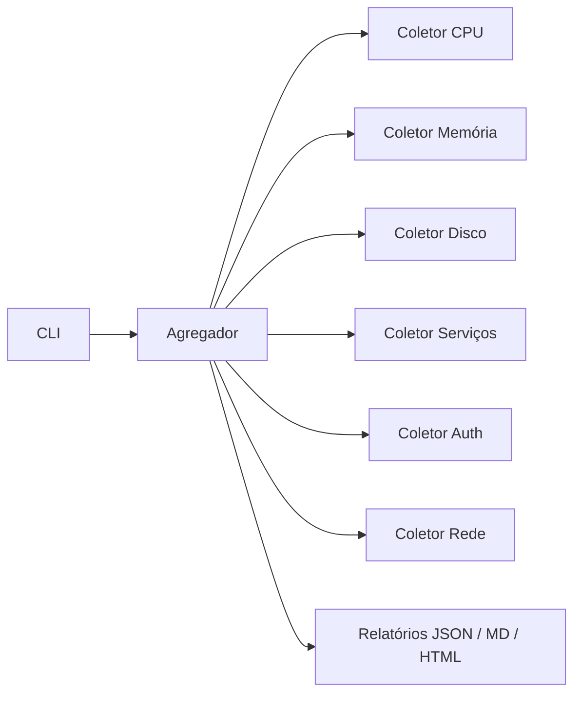

# Arquitetura

Cada coletor é independente. Falha em um coletor (ex.: systemd ausente no Windows) não impede o snapshot: a seção fica vazia e um aviso pode ser registrado.

Limiares vêm de `config/config.yaml`. A CLI apenas orquestra coleta e renderização.
